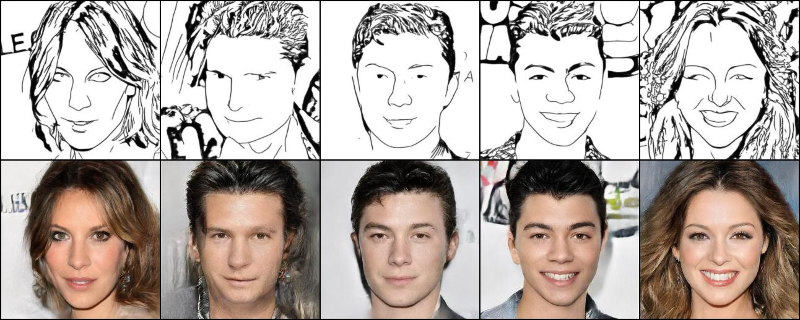

# Sketch-to-image-deep-learning
An end-to-end deep learning pipeline that transforms sketches of human faces into photorealistic images. Utilizes convolutional neural networks, generative adversarial networks, and autoencoders.

